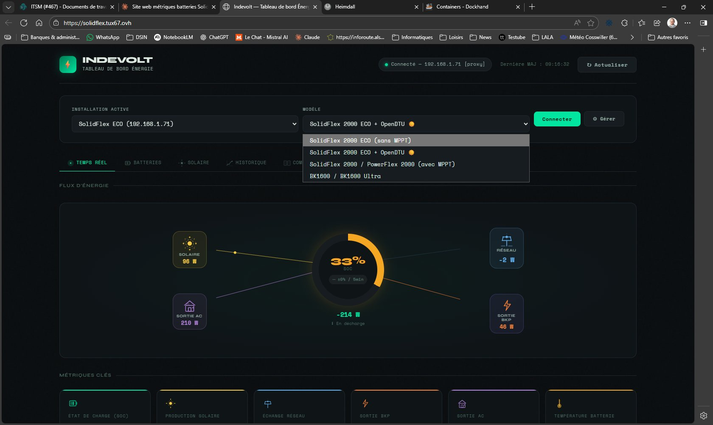
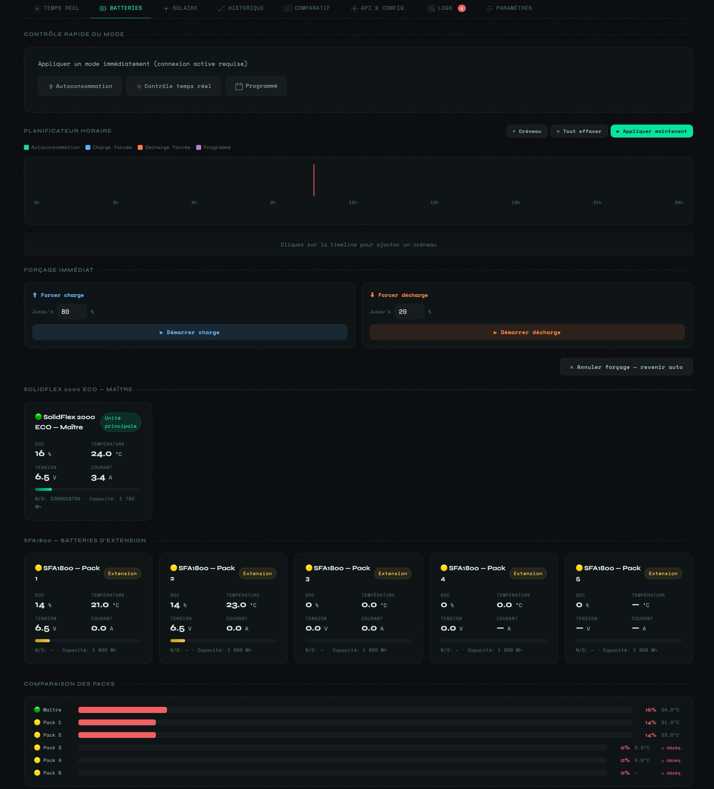
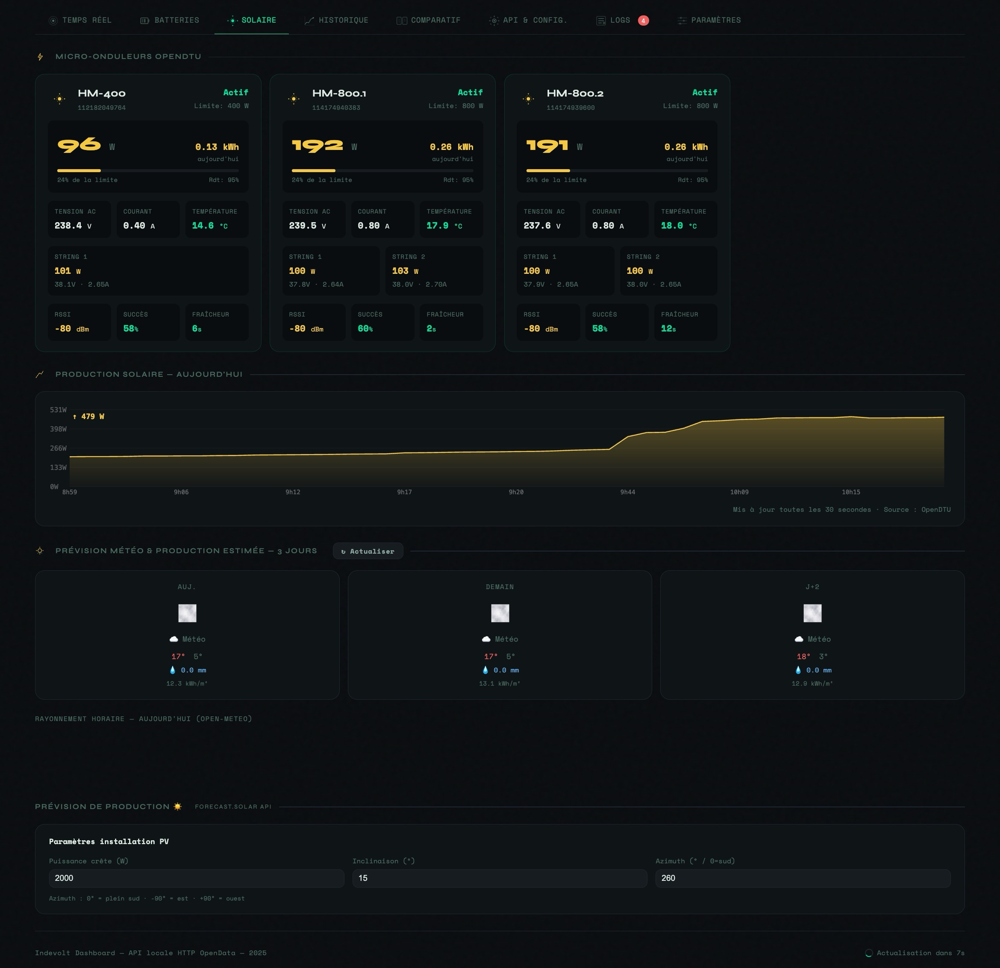
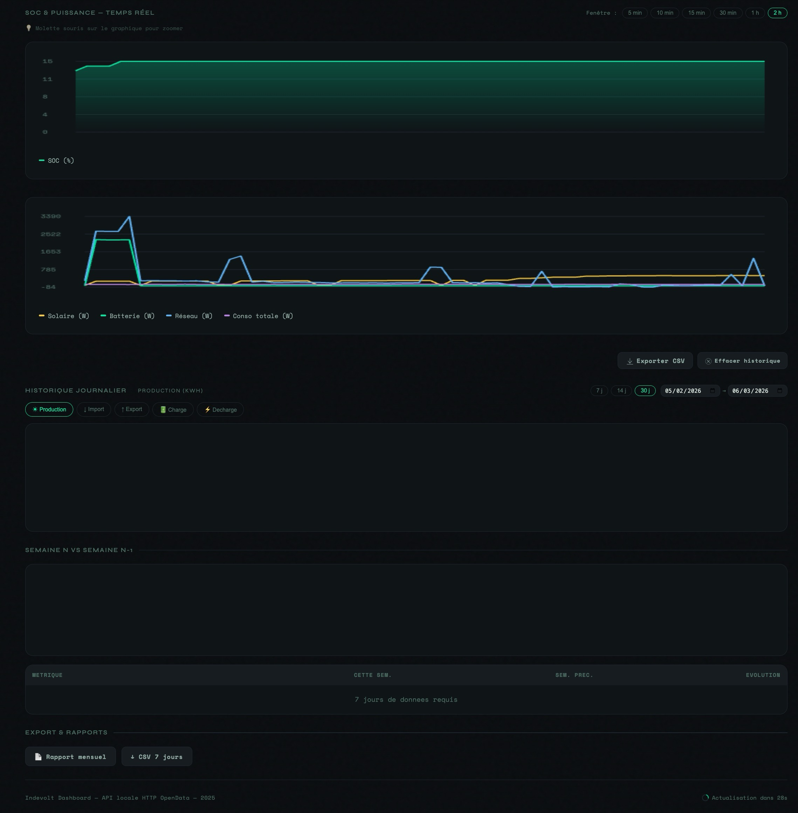
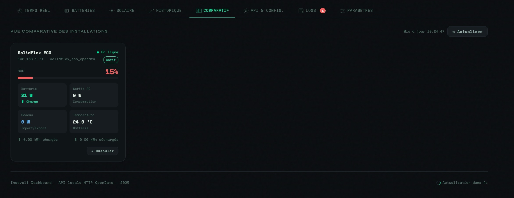
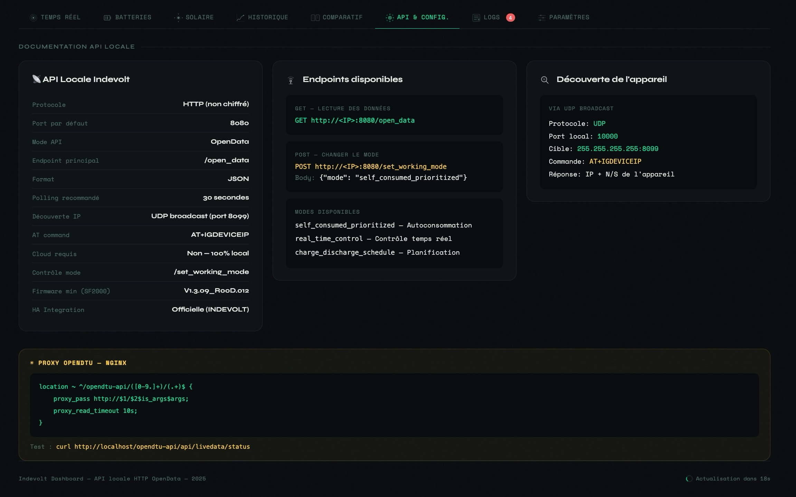
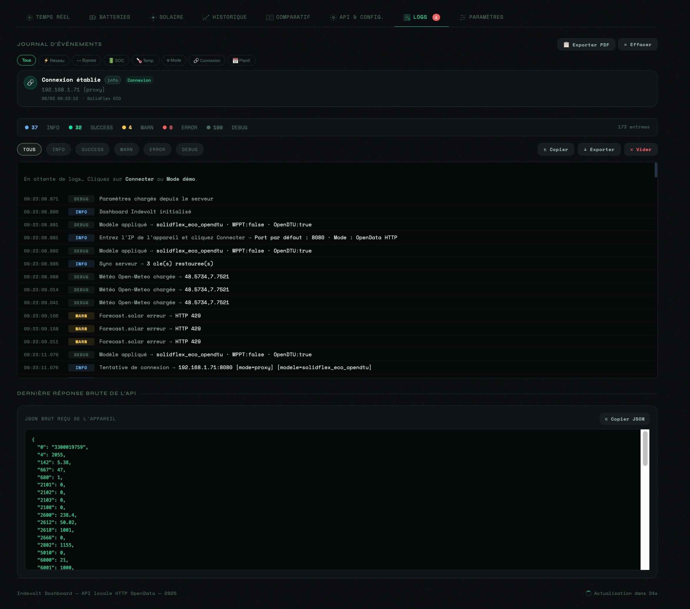
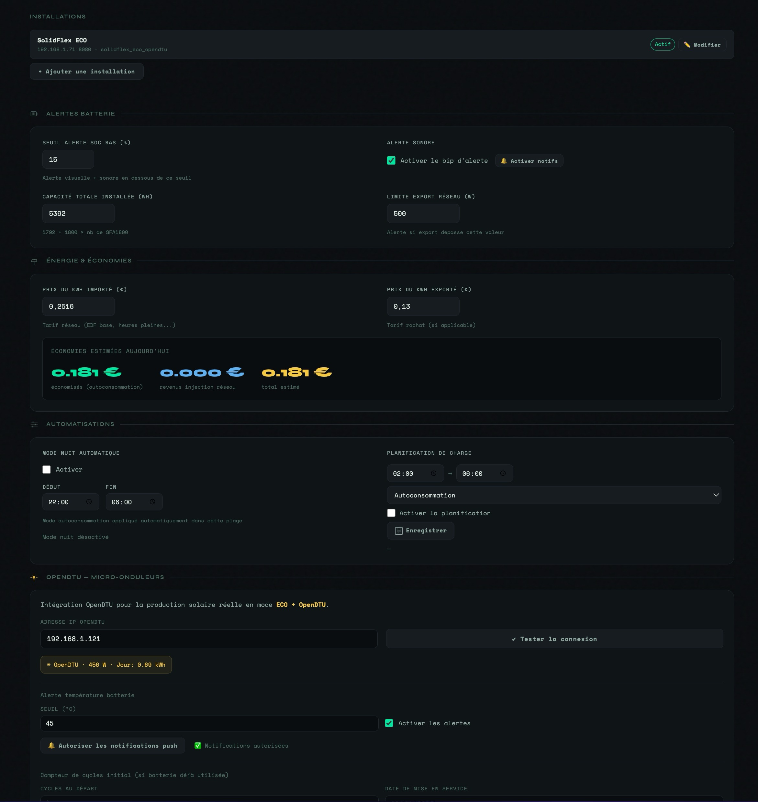

# ⚡ Indevolt Dashboard

<div align="center">


**Dashboard de supervision temps réel pour batteries Indevolt / C3 Techno**  
*SolidFlex 2000 ECO · SFA1800 · Micro-onduleurs Homiles via OpenDTU*

[📦 Installation](#-installation-rapide) · [⚙️ Configuration](#️-configuration) · [📖 Onglets](#-onglets) · [🐳 Docker](#-docker) · [❓ FAQ](#-faq)

</div>

---

## 📸 Aperçu









> Onglet **Temps réel** — Flux d'énergie avec sélecteur de modèle. De gauche à droite : nœuds sources/charges, hub batterie central avec SOC et tendance, métriques clés en bas.

**Navigation multi-onglets :**
```
[ Temps réel ] [ Batteries ] [ Solaire ] [ Historique ] [ Comparatif ] [ API ] [ Logs ] [ Paramètres ]
```

---

## ✨ Fonctionnalités

| Catégorie | Fonctionnalité |
|-----------|---------------|
| 📡 **Temps réel** | Polling toutes les 30s · Flux d'énergie animé · SOC avec tendance |
| 🔋 **Batteries** | Contrôle mode direct · Planificateur horaire visuel drag & drop · Forçage charge/décharge |
| ☀️ **Solaire** | Micro-onduleurs OpenDTU (HM-400, HM-800) · Prévision **forecast.solar** · Météo Open-Meteo |
| 📊 **Historique** | Graphiques 7j avec zoom 5min–2h · Historique 30j · Comparaison semaine N vs N-1 |
| 🏘️ **Multi-installations** | Tableau comparatif SOC/puissance/température · Fetch parallèle · Auto-refresh 30s |
| 📋 **Journal** | Détection coupures réseau, bypass, alertes SOC/temp · Export PDF horodaté |
| 💾 **Persistance** | Stockage serveur via sidecar Python (survit aux rechargements de page) |
| 📱 **Responsive** | Mobile complet · Bottom nav fixe · Swipe entre onglets · Pinch-to-zoom |

---

## 🚀 Installation rapide

### Prérequis

- Docker Engine ≥ 20.x
- Docker Compose v2
- Accès réseau local à votre onduleur Indevolt (même sous-réseau)

### 1. Cloner le dépôt

```bash
git clone https://github.com/struppy/indevolt-dashboard.git
cd indevolt-dashboard
```

### 2. Lancer les conteneurs

```bash
mkdir -p data/store
docker compose up -d
```

### 3. Ouvrir le dashboard

```
http://VOTRE_IP_SERVEUR:8480
```

> ✅ Le dashboard est accessible depuis n'importe quel navigateur sur votre réseau local.

---

## ⚙️ Configuration

### 🔑 Paramètres obligatoires

Ces paramètres sont à renseigner **dans l'interface** (onglet ⚙️ Paramètres), ou peuvent être pré-configurés en éditant `html/index.html` avant le premier lancement.

#### Connexion onduleur

| Paramètre | Valeur par défaut | Description |
|-----------|-------------------|-------------|
| Adresse IP | `192.168.1.71` | IP locale de votre onduleur Indevolt |
| Port | `8080` | Port HTTP de l'API locale |
| Modèle | `SolidFlex ECO` | Voir modèles supportés ci-dessous |

#### Modèles supportés

| Modèle | Description |
|--------|-------------|
| SolidFlex 2000 ECO (sans MPPT) | Mode ECO sans entrée solaire directe |
| SolidFlex 2000 ECO + OpenDTU | Mode ECO avec micro-onduleurs HM-400/HM-800 via OpenDTU |
| SolidFlex 2000 / PowerFlex 2000 (avec MPPT) | Avec contrôleur MPPT intégré |
| BK1600 / BK1600 Ultra | Gamme BK1600 |

### 🌤️ Paramètres optionnels

#### Localisation météo & solaire

| Paramètre | Défaut | Description |
|-----------|--------|-------------|
| Latitude | `48.5734` | Latitude de l'installation (Strasbourg par défaut) |
| Longitude | `7.7521` | Longitude de l'installation |
| Puissance crête PV | `2000 W` | Somme des puissances des micro-onduleurs |
| Inclinaison panneaux | `35°` | Angle d'inclinaison du toit |
| Azimuth | `0°` | Orientation (0° = plein sud, -90° = est, +90° = ouest) |

#### Alertes

| Paramètre | Défaut | Description |
|-----------|--------|-------------|
| Seuil SOC alerte | `20%` | Notification batterie faible |
| Seuil température | `45°C` | Alerte surchauffe batterie |
| Limite export réseau | `500 W` | Alerte dépassement export |

#### Tarifs électricité

| Paramètre | Défaut | Description |
|-----------|--------|-------------|
| Prix import | `0.2516 €/kWh` | Tarif EDF/fournisseur import |
| Prix export | `0.13 €/kWh` | Tarif rachat surplus |

### 🔧 OpenDTU (micro-onduleurs)

Si vous utilisez des micro-onduleurs avec OpenDTU :

1. Activer **OpenDTU** dans Paramètres → renseigner l'IP de votre passerelle OpenDTU
2. Les serials des micro-onduleurs sont à modifier dans `html/index.html` :

```javascript
// Chercher et remplacer ces serials par les vôtres
// (onglet Paramètres > OpenDTU > Serial visible sur l'étiquette de chaque micro-onduleur)
const HM400_SERIAL  = '112182049764';   // ← Remplacer
const HM800_1_SERIAL = '114174940383';  // ← Remplacer
const HM800_2_SERIAL = '114174939600';  // ← Remplacer
```

> 💡 Les serials se trouvent sur l'étiquette de chaque micro-onduleur ET dans l'interface web d'OpenDTU.

---

## 📖 Onglets

### ⚡ Live — Tableau de bord principal

Vue synthétique de l'installation en temps réel.

**Ce que vous voyez :**
- **Flux d'énergie** : diagramme avec les 4 nœuds (Solaire, Sortie AC, Réseau, Sortie BKP) reliés au hub batterie central
- **Hub batterie** : SOC en anneau coloré (vert > 60%, orange > 30%, rouge < 30%), puissance instantanée, tendance SOC sur 5 minutes
- **Métriques** : Production solaire · Consommation totale · Import/Export réseau · Autonomie estimée · Économies du jour · Taux d'autoconsommation
- **Mode opérationnel** actif (Autoconsommation / Charge / Décharge / Programmé)

**Indicateurs d'état :**
- 🟢 Connecté — données fraîches
- 🟡 Données anciennes — connexion instable
- 🔴 Hors ligne — onduleur injoignable

---

### 🔋 Batteries — Contrôle & planification

Contrôle complet du mode de fonctionnement et suivi de santé.

**Contrôle rapide :**
- Boutons directs : Autoconsommation / Contrôle temps réel / Programmé

**Planificateur horaire visuel :**
- Timeline 24h avec créneaux colorés par mode
- **Clic** sur la timeline → ajoute un créneau
- **Glisser-déposer** pour déplacer · **Handles** pour redimensionner
- Snap automatique à 30 minutes
- 4 modes : Autoconsommation 🟢 · Charge forcée 🔵 · Décharge forcée 🟠 · Programmé 🟣
- SOC cible par créneau (arrêt automatique quand atteint)

**Forçage immédiat :**
- ⬆ Forcer charge jusqu'à X% SOC
- ⬇ Forcer décharge jusqu'à Y% SOC
- Arrêt automatique dès que le SOC cible est atteint

**Suivi santé :**
- Compteur de cycles (estimation sur 6 000 cycles de vie)
- Courbe de dégradation SOC max sur 60 jours
- Projection durée de vie restante

---

### ☀️ Solaire — Production & prévisions

Supervision des micro-onduleurs et prévision météo.

**Micro-onduleurs (OpenDTU) :**
- État de chaque onduleur (En ligne / Hors ligne)
- Puissance AC instantanée · Production du jour
- Température · RSSI WiFi · Taux de succès radio

**Prévision forecast.solar :**
- Production estimée en kWh pour aujourd'hui, demain et J+2
- Courbe horaire de production prévue
- Basé sur la position réelle des panneaux (inclinaison + azimuth)

**Météo Open-Meteo :**
- Icônes météo WMO sur 3 jours
- Température min/max · Précipitations
- Rayonnement horaire (W/m²)

**Paramètres PV** directement dans l'onglet :
- Puissance crête, inclinaison, azimuth → mise à jour immédiate des prévisions

---

### 📊 Historique — Graphiques & tendances

Analyse des données sur 7 jours et 30 jours.

**Graphique temps réel (7 jours) :**
- 4 courbes : SOC · Production solaire · Puissance batterie · Échanges réseau
- **Zoom** : boutons 5min / 10min / 15min / 30min / 1h / 2h
- **Molette souris** sur le graphique pour zoomer
- **Pinch-to-zoom** sur mobile
- Buffer 6h de données (point toutes les 30s)

**Historique 30 jours :**
- Graphique barres avec 5 métriques sélectionnables : Production / Import / Export / Charge / Décharge
- Sélecteur de plage : 7j / 14j / 30j ou dates personnalisées

**Comparaison hebdomadaire :**
- Semaine N vs semaine N-1
- Tableau d'évolution avec flèches colorées (↑ mieux · ↓ moins bien)

**Export :**
- Rapport mensuel HTML téléchargeable (imprimable en PDF)

---

### 🏘️ Comparatif — Multi-installations

Vue comparative si vous disposez de plusieurs installations Indevolt.

- Carte par installation : SOC · Puissance batterie · Sortie AC · Réseau · Température
- Barre SOC colorée selon niveau
- Statut temps réel (En ligne / Données anciennes / Hors ligne)
- Bouton **→ Basculer** pour passer le contrôle principal sur une installation
- Graphique barres SOC comparatif
- **Auto-refresh toutes les 30 secondes**

> 💡 Gérez vos installations dans Paramètres → Installations

---

### 📡 API — Documentation

Référence des endpoints disponibles :
- API locale Indevolt (registres Modbus)
- Proxy nginx (routes disponibles)
- Endpoints sidecar Python (stockage persistant)
- Exemples de requêtes curl

---

### 📋 Logs — Journal d'événements

Traçabilité complète de l'installation.

**Détection automatique :**
| Événement | Sévérité |
|-----------|----------|
| ⚡ Coupure réseau (tension < 50V) | 🔴 Critique |
| ⚡ Retour réseau | ℹ️ Info |
| ↔ Passage en bypass | ⚠️ Avertissement |
| 🔋 Franchissement seuil SOC bas | ⚠️ Avertissement |
| 🔋 SOC critique (< 10%) | 🔴 Critique |
| 🌡 Dépassement seuil température | 🔴 Critique |
| ⚙ Changement de mode opérationnel | ℹ️ Info |
| 🔗 Connexion/déconnexion | ℹ️ Info |
| 📅 Activation créneau planifié | ℹ️ Info |

**Fonctionnalités :**
- Filtre par type d'événement
- Badge rouge sur l'onglet en cas d'alerte
- Persistance serveur (survit aux rechargements)
- **Export PDF horodaté** avec tableau complet

---

### ⚙️ Paramètres

Tous les réglages de l'installation :
- Connexion onduleur (IP, port, modèle)
- Multi-installations (ajout, modification, suppression)
- OpenDTU (activation, IP passerelle)
- Localisation météo (lat/lon)
- Alertes (SOC, température, export)
- Tarifs électricité (import/export)
- Mode nuit (horaires automatiques)
- Notifications push navigateur
- Compteur de cycles (date de départ, cycles initiaux)

---

## 🐳 Docker

### Structure des fichiers

```
indevolt-dashboard/
├── docker-compose.yml      # Orchestration nginx + sidecar Python
├── nginx/
│   └── default.conf        # Proxy inverse + routes API
├── html/
│   └── index.html          # Dashboard (fichier unique ~330 KB)
├── settings_api.py         # Sidecar Python — persistance données
├── data/
│   └── store/              # Données JSON (créé automatiquement)
├── .gitignore
└── README.md
```

### docker-compose.yml

```yaml
version: '3.8'
services:
  nginx:
    image: nginx:alpine
    ports:
      - "8480:80"
    volumes:
      - ./html:/usr/share/nginx/html:ro
      - ./nginx/default.conf:/etc/nginx/conf.d/default.conf:ro
    depends_on:
      - settings-api
    restart: unless-stopped

  settings-api:
    image: python:3.11-alpine
    working_dir: /app
    volumes:
      - ./settings_api.py:/app/settings_api.py:ro
      - ./data:/data:rw
    command: python settings_api.py
    restart: unless-stopped
```

### Commandes utiles

```bash
# Démarrer
docker compose up -d

# Voir les logs
docker compose logs -f

# Redémarrer après modification de index.html
docker compose restart nginx

# Arrêter
docker compose down

# Arrêter et supprimer les données
docker compose down -v
```

### Ports utilisés

| Port | Service | Description |
|------|---------|-------------|
| `8480` | nginx | Dashboard web (accès navigateur) |
| `8081` | settings-api | API Python interne (non exposé hors Docker) |

---

## 🔒 Sécurité

- Le proxy nginx est configuré pour **n'autoriser que les IPs du sous-réseau `192.168.1.x`** — il refuse les requêtes vers d'autres destinations (protection SSRF)
- Aucune donnée n'est envoyée vers l'extérieur sauf :
  - `api.open-meteo.com` — météo (pas de clé API)
  - `api.forecast.solar` — prévision production (pas de clé API)
- Le dashboard est conçu pour un usage **LAN uniquement** — ne pas exposer sur internet sans authentification

---

## ❓ FAQ

**Le dashboard affiche "Non connecté" en permanence**
> Vérifiez que l'IP de l'onduleur est correcte dans Paramètres. Vérifiez que le serveur Docker est sur le même sous-réseau que l'onduleur. Testez `curl http://IP_ONDULEUR:8080/Indevolt.GetData` depuis le serveur.

**Les micro-onduleurs affichent 0 W**
> Activez OpenDTU dans Paramètres, renseignez l'IP de votre passerelle OpenDTU, et vérifiez que les serials correspondent à vos appareils (étiquette sur le boîtier).

**La prévision solaire semble incorrecte**
> Ajustez la puissance crête (W), l'inclinaison et l'azimuth dans l'onglet Solaire. Ces 3 paramètres sont essentiels pour forecast.solar.

**L'historique se vide après redémarrage**
> Vérifiez que le volume `./data:/data:rw` est bien monté dans docker-compose.yml et que le dossier `data/store/` existe sur l'hôte.

**Le comparatif affiche les installations comme hors ligne**
> Toutes les installations doivent être accessibles depuis le serveur Docker sur le port 8080. Vérifiez la connectivité réseau entre le serveur et chaque onduleur.

---

## 🔄 Mise à jour

```bash
git pull
docker compose restart nginx
```

Les données persistantes dans `data/store/` ne sont pas affectées.

---

## 📄 Licence

MIT — Libre d'utilisation, modification et distribution.

---

<div align="center">

Fait avec ☕ pour la communauté Indevolt / C3 Techno

*Ce projet n'est pas affilié à C3 Techno — utilisation de l'API locale à vos risques et périls*

</div>
